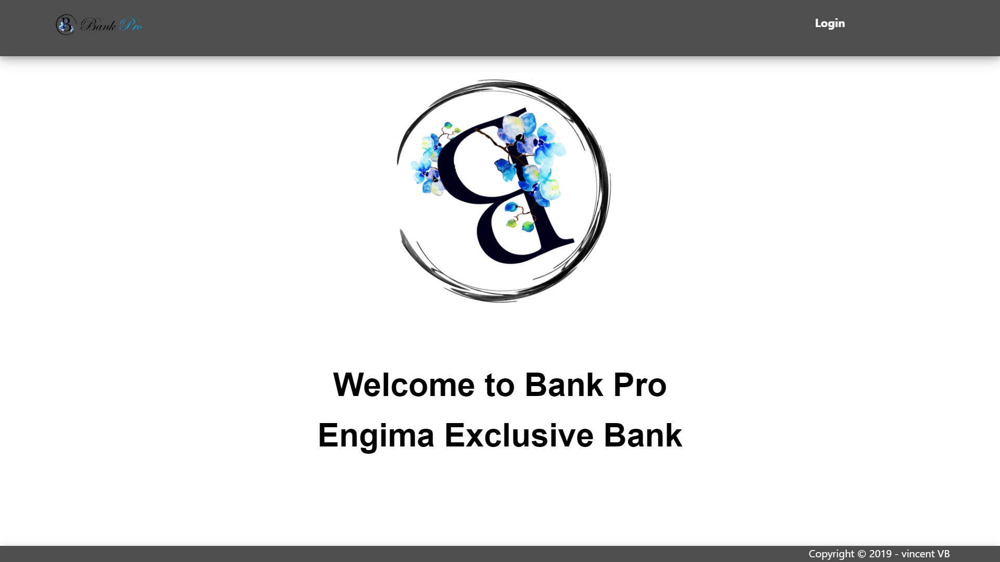
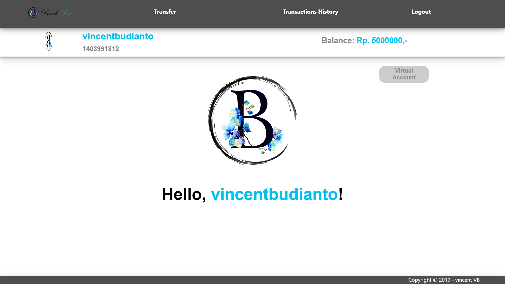
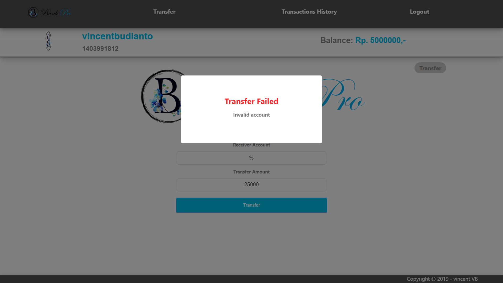

<h1 align="center">
    <b>
        <br>
        # Tugas Besar 2 IF3110 Pengembangan Aplikasi Berbasis Web
        <br>
    </b>
</h1>

<h2 align="center">
    <b>
        Bank Pro
        <br>
        <br>
    </b>
</h2>

## Deskripsi Singkat
Bank Pro dibuat dengan menggunakan create-react-app

Beberapa dependencies tambahan yang dibutuhkan oleh aplikasi Bank Pro:
1. xml2js
<br>
```npm install --save xml2js```
2. universal cookie
<br>
```npm install --save universal-cookie```

<br>
Cara menjalankan:

ketikan ```npm start``` pada direktori aplikasi Bank Pro

## Screenshots

### Title


<br>
<br>

<br>
<br>

### Login


<br>
<br>

### Transfer


<br>
<br>

<br>
<br>

<br>
<br>

<br>
<br>

<br>
<br>

<br>
<br>

<br>
<br>

### Transactions History


<br>
<br>

<p align="center">
    <b>
        <br>
        <font size="6">
            About
        </font>
    </b>
</p>

<p align="center">
    <b>
        IF3110-Pengembangan Aplikasi Berbasis Web - 2019
        <br>
        Teknik Informatika 2017
        <br>
        <br>
        13517137 - Vincent Budianto
    </b>
</p>