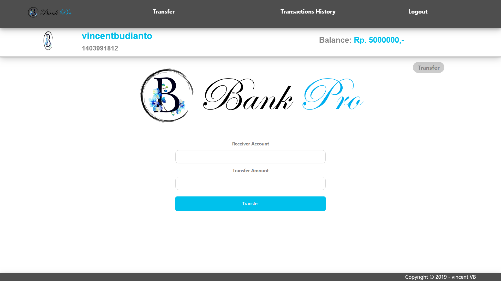
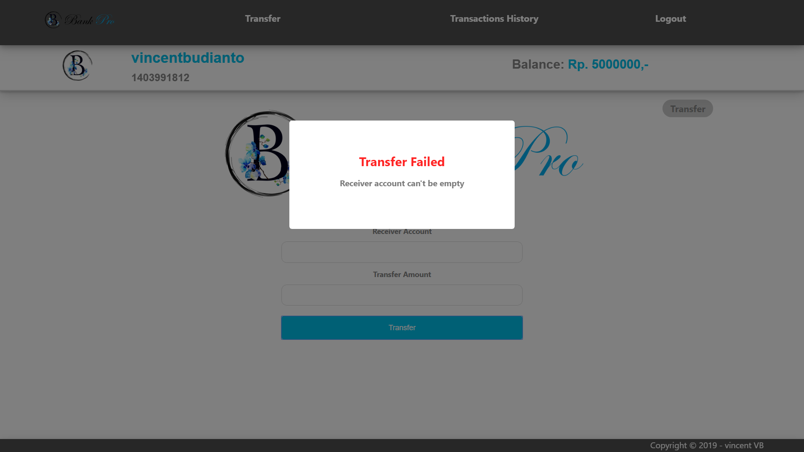

<h1 align="center">
    <b>
        <br>
        # Tugas Besar 2 IF3110 Pengembangan Aplikasi Berbasis Web / IF3159 Dasar Pembangunan Perangakat Lunak
        <br>
    </b>
</h1>

<h2 align="center">
    <b>
        Bank Pro
        <br>
        <br>
    </b>
</h2>

## Deskripsi Singkat
Aplikasi Bank Pro merupakan aplikasi simulasi perbankan berbasis web yang dibuat dengan menggunakan kakas ReactJs.

Inisialisasi React :<br>
ketikan ```create-react-app [Nama_Folder]``` untuk menginisiasi pembuatan aplikasi ReactJs pada folder [Nama_Folder]

Beberapa dependencies tambahan yang dibutuhkan oleh aplikasi Bank Pro:
1. xml2js <br>
```npm install --save xml2js```
2. universal cookie <br>
```npm install --save universal-cookie```

Dependency yang digunakan untuk linting:
1. eslint<br>
```npm install eslint -g```
1. babel-eslint parser<br>
```npm install babel-eslint --save-dev```

Cara menjalankan:

| local                                                    |
|:--------------------------------------------------------:|
| ketikan ```npm start``` pada direktori aplikasi Bank Pro |
<br>

## Screenshots

### Title


<br>
<br>

<br>
<br>

<br>
<br>

### Login


<br>
<br>

<br>
<br>

### Transfer


<br>
<br>

<br>
<br>

<br>
<br>

<br>
<br>

<br>
<br>

<br>
<br>

<br>
<br>

<br>
<br>

### Add Balance


<br>
<br>

<br>
<br>

<br>
<br>

<br>
<br>

### Transactions History


<br>
<br>

<br>
<br>

## Pembagian Tugas

### CI/CD
| Number | Feature                | Assignment         |
|:------:|:-----------------------|:-------------------|
| 1.     | Linting                | 13517137           |
| 2.     | Unit testing           | 13517026           |
| 3.     | Deployment to AWS EC2  | 13517026, 13517137 |

<p align="center">
    <b>
        <br>
        <font size="6">
            About
        </font>
    </b>
</p>

<p align="center">
    <b>
        IF3110-Pengembangan Aplikasi Berbasis Web - 2019
        <br>
        Teknik Informatika 2017
        <br>
        <br>
        13517137 - Vincent Budianto
    </b>
</p>